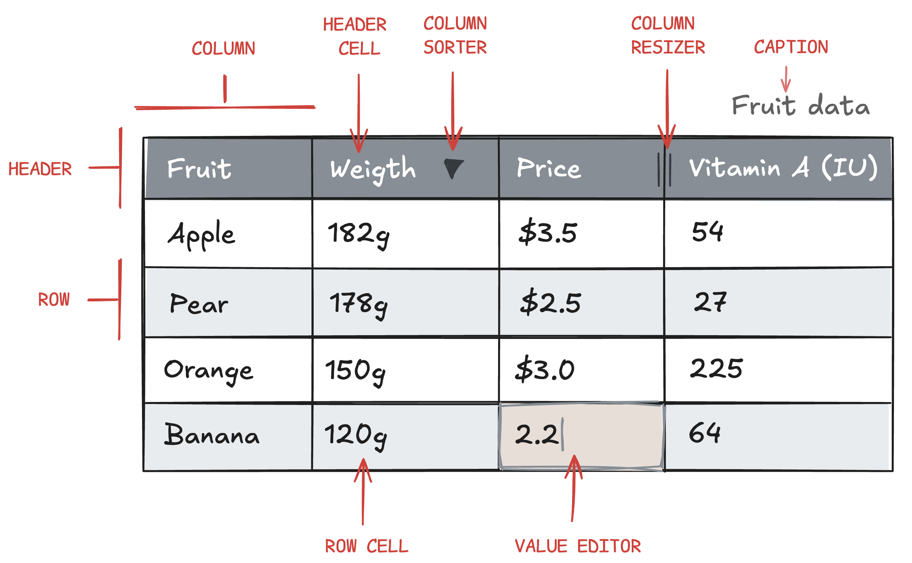

# Understanding DataGrid
At its core the DataGrid consists of a data source that is rendered in x number of columns and rows. Many of the available configuration options applies to the columns and their corresponding row and header cells.



The following provides an introduction the various root configuration objects in DataGrid:

## dataTable
```js
{
    dataTable: {
        columns: {
            product: ["Apple", "Pear", "Orange", "Banana"],
            weight: [182, 178, 150, 120],
            price: [3.5, 2.5, 3, 2.2],
            vitamin_a: [54,27,225,64]
        }
    }
}
```

The `dataTable` object is the only required option needed for proper rendering of the DataGrid, and `dataTable.columns` creates an instance of the DataTable class. This is an object with key-value pairs where key is used for the header cell and value is an array of values for the corresponding row cells.

Read more about [data handling and the DataTable class](https://www.highcharts.com/docs/dashboards/data-table).

## columnDefaults and columns[]
```js
{
    columnDefaults: {
        cells: {
            editable: true
        }
    },
    columns: [
        {
            id: "weight",
            header: {
                format: "Weight"
            },
            cells: {
                format: "{value}g"
                editable: false
            }
        },
        {
            id: "price",
            header: {
                format: "Price"
            },
            cells: {
                format: "${value}"
            }
        }
    ]
}
```

Default options for all columns in the DataGrid, such as the column sorter, column resizer, value editor, cell format etc., are defined in the `columnDefaults` object, and the `columns[]` array of objects can be used to ovveride defaults in selected columns if needed. Note that most of the options in `columnDefaults` are mirrored 1:1 in the `columns[]` array of objects.

Learn more about `columns[]` in our [Columns article](https://www.highcharts.com/docs/datagrid/columns) or see the [API reference](https://api.highcharts.com/dashboards/#interfaces/DataGrid_Options.Options-1#columnDefaults).

## caption
```js
{
    caption: {
        text: "Title of the DataGrid";
    }
}
```

The caption of the rendered table, inserted into the `<caption>` HTML element.

For more information on the `caption` option see the [API reference](https://api.highcharts.com/dashboards/#interfaces/DataGrid_Options.Options-1#caption).

## header[]
```js
{
    header: [
        {
            columnId: "product"
            format: "Fruit",
        },
        "weight",
        "price"
    ]
}
```

While format and visibility of individual columns and their header cells can be set using the `columns[]` option, the same can be achived using the `header[]` root option. Which option to use depends on your spesific use case, and `header[]` will in some cases be less verbose than `columns[]`.

In addition the `header[]` option can be used to change order of headers and group headers in a hierarchical structure.

You can find more information about `header[]` in our [Header article](https://www.highcharts.com/docs/datagrid/header).

## rendering
The `rendering` option object can be used to configure options related to performance and the rendering of the DataGrid. E.g. [rendering.rows](https://api.highcharts.com/dashboards/#classes/DataGrid_Table_Row.Row-1) represents the rows in the DataGrid.

```js
{
    rendering: {
        rows: {
            bufferSize: 5,
            strictHeights: true
        }
    }
}
```

For more information on row rendering settings see the [API reference](https://api.highcharts.com/dashboards/#interfaces/DataGrid_Options.RowsSettings).

## events
The DataGrid supports a number of event listeners that can be added to the header, columns and cells. These allows for custom functionality and extendibility of the DataGrid. Read more about events in our [Events article](https://www.highcharts.com/docs/datagrid/events)
